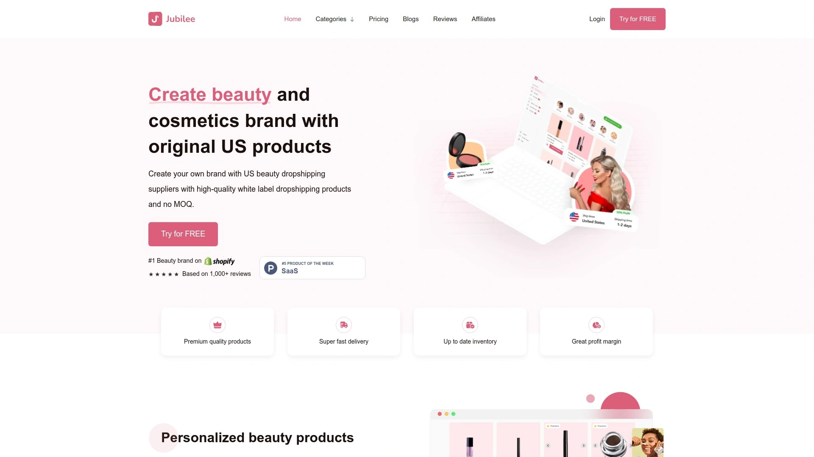
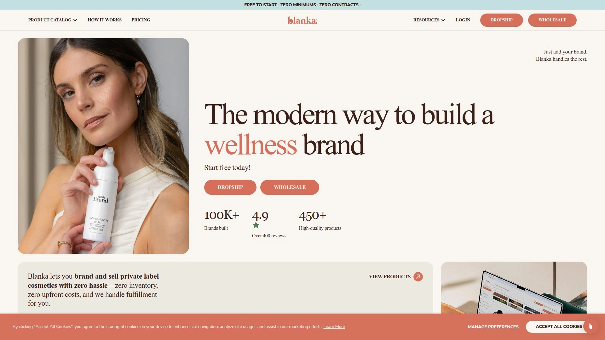
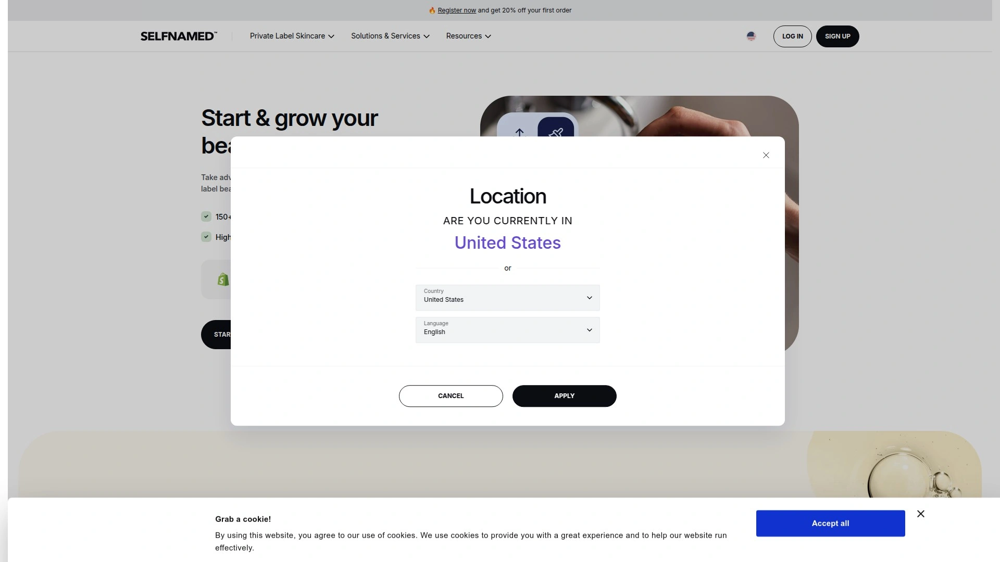
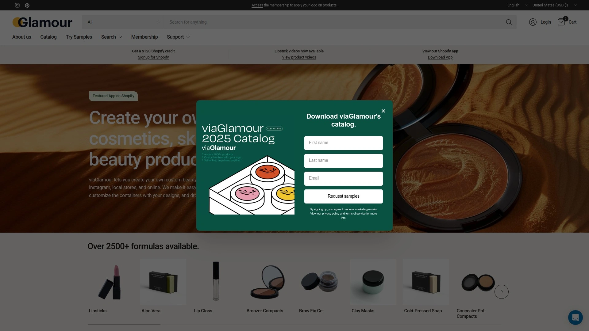
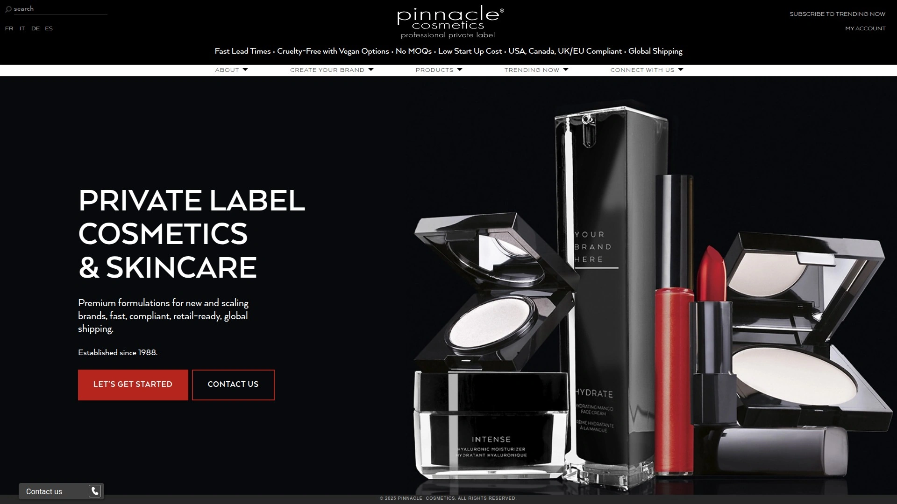

# Latest Private Label Beauty Dropshipping Platforms Collection (Including Performance Reviews)

Building your own beauty brand traditionally means ordering thousands of units upfront, renting warehouse space storing unsold inventory, and hiring fulfillment teams packing shipments—draining $50,000+ before making a single sale while unsold products expire becoming worthless. Traditional cosmetics manufacturing forces minimum order quantities exceeding $10,000 per SKU, trapping entrepreneurs in inventory they can't sell while competitors launch new products weekly responding to trending ingredients and viral TikTok demands.

The best private label beauty dropshipping platforms combine zero minimum order quantities letting you test products risk-free, US-based manufacturing delivering 2-3 day shipping rather than month-long waits from overseas suppliers, and complete customization including branded packaging, custom labels, and personalized invoicing—transforming beauty entrepreneurship from capital-intensive manufacturing into accessible e-commerce anyone can launch from their phone.

***

## **[Jubilee Beauty](https://www.jubilee.beauty)**

Premium US beauty dropshipping with branded invoicing and no MOQ requirements.

Jubilee revolutionizes beauty entrepreneurship by providing complete dropshipping infrastructure enabling anyone to launch cosmetics and skincare brands without inventory investment, manufacturing expertise, or fulfillment logistics. The platform connects entrepreneurs with US-based beauty suppliers delivering high-quality products directly to customers under your brand name—eliminating the traditional barriers preventing most people from entering lucrative beauty markets dominated by capital-rich corporations.

Over 80% of Jubilee's dropshipping suppliers operate from US or European locations, ensuring fast 2-5 day shipping that matches customer expectations shaped by Amazon Prime rather than disappointing them with 3-4 week waits typical of Asian suppliers. This geographic advantage proves critical for customer satisfaction, repeat purchases, and positive reviews driving organic growth through word-of-mouth rather than expensive paid advertising compensating for poor delivery experiences destroying brand reputation.

**Complete customization capabilities** transform generic products into distinctive branded merchandise through personalized logos, custom label designs, branded packaging, and invoices featuring your company information rather than supplier details revealing dropshipping arrangements. This white-label presentation maintains professional brand image preventing customers from discovering they're receiving dropshipped products—a common complaint destroying trust when generic packaging arrives revealing business models rather than appearing as legitimate brand operations.

Sample ordering functionality built directly into the dashboard enables testing products before committing to selling them, eliminating the risk of promoting items that disappoint upon arrival. Order samples with a few clicks, evaluate quality firsthand, assess packaging presentation, and test delivery timeframes ensuring everything meets standards before adding products to your store. This testing capability prevents the devastating scenario where customers receive inferior products damaging brand reputation before you've personally verified quality.

Zero minimum order quantities mean you sell products one unit at a time without bulk purchasing requirements tying up capital in unsold inventory. Traditional private label manufacturing demands ordering hundreds or thousands of units per SKU, creating massive financial risk when products don't sell as anticipated. Jubilee eliminates this barrier, letting you test multiple products simultaneously discovering winners before scaling successful items and abandoning underperformers without losses.

The free plan provides full access to explore products, test the platform, and evaluate suppliers before committing financially—unusual generosity in industries typically charging setup fees, monthly subscriptions, or minimum purchase requirements before providing access. This risk-free entry enables experimenting with beauty entrepreneurship without financial commitments, making private label accessible to students, side hustlers, and aspiring entrepreneurs unable to invest thousands upfront.

***

## **[Blanka](https://blankabrand.com)**

Create branded beauty lines in 5 minutes with 450+ Canadian-made vegan products.

Blanka dominates the private label beauty space through its revolutionary mobile-first platform enabling complete beauty brand creation from smartphones in under five minutes. This accessibility democratizes beauty entrepreneurship by removing technical barriers requiring web development knowledge, graphic design skills, or complex supply chain understanding—anyone with a phone and product vision can launch professional beauty brands competing against established companies spending millions on infrastructure Blanka provides instantly.

The 450+ product catalog spans makeup, skincare, cosmetics, lipstick, lip gloss, eyeshadow, mascara, men's skincare, beauty accessories, and subscription boxes—comprehensive selection eliminating needs for multiple supplier relationships coordinating different product categories. This one-stop approach simplifies operations, consolidates support under single point of contact, and enables cohesive branding across entire product ranges rather than mixing packaging styles from different suppliers creating disjointed customer experiences.

**Canadian manufacturing with vegan and cruelty-free certifications** appeals to conscious consumers increasingly demanding ethical beauty products aligned with personal values. The Canadian sourcing particularly resonates with customers prioritizing North American manufacturing over overseas production, willing to pay premiums for locally-made products supporting domestic jobs while avoiding concerns about ingredient safety and quality control common with international suppliers lacking rigorous oversight.

Zero inventory requirements through automated dropshipping mean Blanka handles fulfillment, packaging, and shipping while you focus on marketing, branding, and customer relationships—the high-value activities driving business growth rather than operational logistics consuming time without revenue generation. Orders placed on your Shopify store automatically route to Blanka for fulfillment, creating seamless experiences where you never touch physical products yet customers receive professionally packaged branded items within days.

The Shopify integration takes one click connecting your e-commerce store directly to Blanka's product catalog and fulfillment systems. Add products to your store in minutes, customize them with your branding through built-in design tools, then start selling immediately with orders processing automatically. This technical simplicity removes barriers preventing non-technical entrepreneurs from launching online businesses, expanding beauty entrepreneurship beyond tech-savvy individuals into broader populations with product visions but limited technical capabilities.

Priority customer support through chat and email provides instant assistance as you build your brand, eliminating the frustrating abandoned ticket systems plaguing larger platforms where support responses take days when urgent issues demand immediate resolution. The hands-on assistance particularly benefits new entrepreneurs encountering unfamiliar e-commerce concepts, needing guidance selecting products, or troubleshooting technical integration issues.

***

## **[Selfnamed](https://www.selfnamed.com)**

Organic skincare dropshipping with no setup fees and EU-certified natural products.

Selfnamed specializes exclusively in skincare rather than broad beauty categories, delivering deep expertise in organic and natural formulations meeting stringent European cosmetics regulations exceeding US standards. This focus creates premium positioning attracting health-conscious consumers willing to pay higher margins for certified organic ingredients, sustainable packaging, and transparent ingredient lists contrasting with mass-market products hiding questionable chemicals behind proprietary formulas.

The 150+ certified organic and natural skincare products carry official certifications validating marketing claims rather than relying on unverified "natural" branding common in beauty industries where regulatory loopholes permit misleading labeling. These certifications include USDA Organic, COSMOS Natural, COSMOS Organic, and Vegan Society approval—third-party validation providing credibility impossible for startups to achieve independently without years of costly compliance work.

**Complete customization with zero minimums** extends beyond simple logo placement into full-color custom labels and branded boxes creating premium unboxing experiences customers photograph for social media, generating organic marketing through user-generated content. The comprehensive branding options enable creating distinctive market positioning rather than generic private-label products indistinguishable from competitors using identical suppliers with minimal differentiation.

European manufacturing with worldwide shipping to 30+ countries provides international reach while maintaining quality standards associated with EU production. The products comply with regulations in EU, UK, and USA markets, eliminating legal barriers when expanding into new geographic regions—critical advantage preventing costly reformulations or repackaging when international expansion opportunities emerge.

Free-to-use platform charges no setup fees, monthly subscriptions, or hidden costs beyond actual product fulfillment and shipping expenses. You keep the full profit margin between wholesale cost and retail pricing, enabling sustainable business models without platform fees eroding margins typical of marketplace models extracting percentages from every transaction. This transparent pricing allows accurate profit calculations rather than discovering unexpected deductions reducing take-home revenue.

The Shopify and WooCommerce integrations provide seamless connections with major e-commerce platforms, automatically syncing product listings, managing inventory levels, and processing orders without manual data entry. These integrations particularly benefit sellers operating multiple sales channels, enabling centralized management rather than logging into separate systems updating each platform individually.

***

## **[viaGlamour](https://viaglamour.com)**

Canadian cosmetics lab with 2,500+ formulas and 2-3 day order fulfillment.

viaGlamour operates as actual cosmetics laboratory in Canada formulating products fresh when orders arrive rather than warehousing pre-manufactured inventory—a fundamental difference ensuring maximum freshness and allowing formula customization impossible with pre-made products sitting in warehouses losing efficacy. This made-to-order approach particularly benefits formulations containing active ingredients degrading over time, delivering maximum potency to end customers rather than aged products manufactured months before sale.

The staggering 2,500+ available formulas provide unprecedented selection spanning makeup, skincare, body care, hair care, and men's products—virtually every beauty category imaginable under single supplier relationship. This extensive catalog eliminates needs for multiple suppliers when building comprehensive beauty brands, simplifying operations, consolidating support, and enabling consistent quality across all product categories rather than variable standards from different manufacturers.

**Zero design fees for custom packaging** removes barriers preventing brands from creating distinctive presentations differentiating their products from generic competitors. Upload your artwork, Blanka applies it to packaging at no additional cost—contrast with traditional private label requiring minimum orders and charging setup fees per design making small-batch customization economically impossible for startups testing markets before committing to large inventories.

FDA-compliant manufacturing following North American regulations provides peace of mind regarding ingredient safety, labeling accuracy, and quality control standards. The Canadian production facility adheres to Good Manufacturing Practices ensuring consistent quality, contamination prevention, and regulatory compliance—reducing liability risks associated with overseas manufacturers lacking oversight or operating under different regulatory frameworks permitting ingredients banned in North America.

Same-day formulation with 2-3 day shipping creates impressive fulfillment timelines rivaling traditional inventory-based models while maintaining freshness advantages of made-to-order production. Orders received are formulated that day, packaged with custom branding, and shipped directly to customers—typically arriving within days of purchase matching expectations shaped by major retailers while providing superior product freshness.

Bulk ordering options accommodate brands graduating from dropshipping into inventory models as sales volumes justify carrying stock. This flexibility provides natural growth path from bootstrapped dropshipping operations into more profitable inventory-based models when revenue supports wholesale purchasing, warehouse space, and fulfillment staff—enabling seamless scaling without switching suppliers disrupting product consistency customers expect.

***

## **[Pinnacle Cosmetics](https://www.pinnaclecosmetics.com)**

Canadian private label manufacturer with 37 years experience and no MOQ requirements.

Pinnacle Cosmetics brings manufacturing credibility through 37 years operational history since 1988, supporting over 20,000 brands globally with proven formulations and retail-ready quality. This longevity demonstrates sustained viability rare in beauty industries where countless suppliers launch then disappear within years, leaving brands stranded without reliable sources for products customers expect to remain available.

No minimum order quantities per shade or SKU provide flexibility impossible with traditional manufacturers demanding thousands of units per color variation. Order precisely what you need across multiple shades without massive inventory investments in slow-moving colors, enabling realistic assortment strategies mirroring successful brands offering extensive shade ranges without tying up six-figure inventories in unpopular options.

**Fast lead times with 2-3 week typical turnaround** from order approval through delivery enables responsive inventory management, seasonal launches, and trend-driven product releases rather than 8-12 week lead times typical of custom manufacturing requiring advance planning preventing opportunistic market responses. This speed proves critical for beauty brands where trending colors, viral ingredients, and influencer endorsements create sudden demand requiring rapid product availability.

The cruelty-free certification with vegan options available across product categories addresses growing consumer demand for ethical beauty products. While not every formula is vegan, the availability across multiple categories enables vegan-focused brands to build complete lines sourced from single manufacturer rather than coordinating multiple suppliers each offering limited vegan selections creating logistical complexity.

GMP-compliant manufacturing in Canada ensures consistent quality and regulatory compliance, meeting North American safety standards and labeling requirements. The pharmaceutical-grade facilities follow Good Manufacturing Practices preventing contamination, ensuring ingredient accuracy, and maintaining batch consistency—quality assurance impossible to verify with overseas manufacturers lacking transparent operations or third-party auditing.

Product sampling through curated sets or à la carte selection enables testing formulas, shades, and textures before committing to branded production runs. This hands-on evaluation proves essential for color cosmetics where online photos inadequately convey actual shades, textures, or application characteristics requiring physical testing ensuring products meet quality standards before selling to customers whose expectations are shaped by premium brands.

***

## FAQ

**Do beauty dropshipping suppliers actually ship fast enough to meet customer expectations?**

US-based suppliers like Jubilee, Blanka, and viaGlamour deliver 2-5 day shipping matching mainstream retail timelines, while overseas suppliers take 3-4 weeks disappointing customers accustomed to Amazon speed. Over 80% of Jubilee's suppliers operate from US or Europe, while viaGlamour formulates and ships from Canada within 2-3 days. Choose North American suppliers when customer satisfaction matters more than absolute lowest costs—the premium pricing enables faster shipping preventing refund requests and negative reviews destroying new brands before gaining traction. Asian suppliers cost less but damage retention rates through poor delivery experiences.

**Can you actually make money with beauty dropshipping or are margins too thin?**

Beauty products command 4-8X markups over wholesale costs—Selfnamed specifically states customers increase profits up to 8+ times wholesale pricing. Traditional retail markup is 2-3X, but beauty's emotional purchasing and brand loyalty enable premium pricing when positioned correctly. Success depends on niche selection, brand positioning, and marketing rather than competing on price against established brands. Focus on specific segments like clean beauty, men's skincare, or ethnic hair care where underserved audiences pay premiums for products addressing their needs rather than broad-market products saturated with established competitors.

**What's the difference between private label, white label, and dropshipping in beauty products?**

Private label means manufacturer produces products sold under your brand with custom formulations, packaging, and branding—you control everything but need minimum orders. White label uses manufacturer's existing formulations with your branding applied—faster and cheaper but less differentiation. Dropshipping means supplier ships directly to customers without you holding inventory—can be private label, white label, or even branded manufacturer products. Platforms like Jubilee and Blanka combine white label products with dropshipping fulfillment, providing branded customization without inventory requirements—ideal for testing markets before committing to full private label manufacturing requiring significant investment.

---

## Conclusion

Private label beauty dropshipping platforms eliminate the traditional barriers of inventory investment, manufacturing minimums, and fulfillment logistics that previously restricted beauty entrepreneurship to well-funded corporations with extensive supply chain expertise. These five platforms provide turnkey infrastructure enabling anyone to launch professional beauty brands from their phone, test products risk-free with zero minimums, and scale successful items without warehouse leases or fulfillment staff. [Jubilee Beauty](https://www.jubilee.beauty) particularly excels for entrepreneurs wanting comprehensive US-based beauty dropshipping—combining 80% domestic suppliers delivering 2-5 day shipping, complete customization including branded invoicing and personalized packaging, sample ordering functionality testing products before selling, and generous free plans enabling risk-free exploration before financial commitment.
